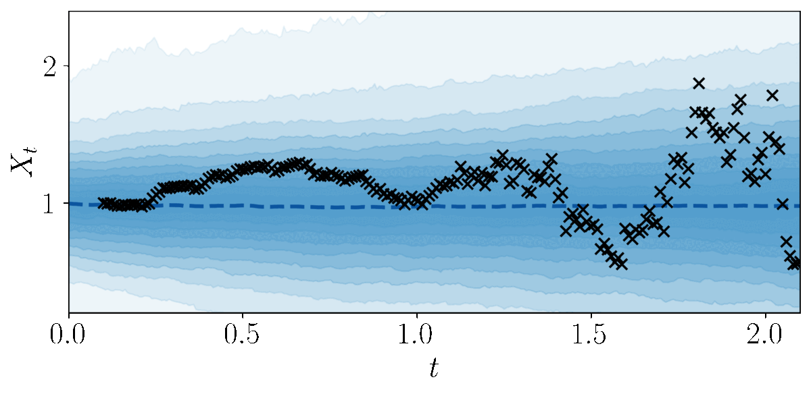
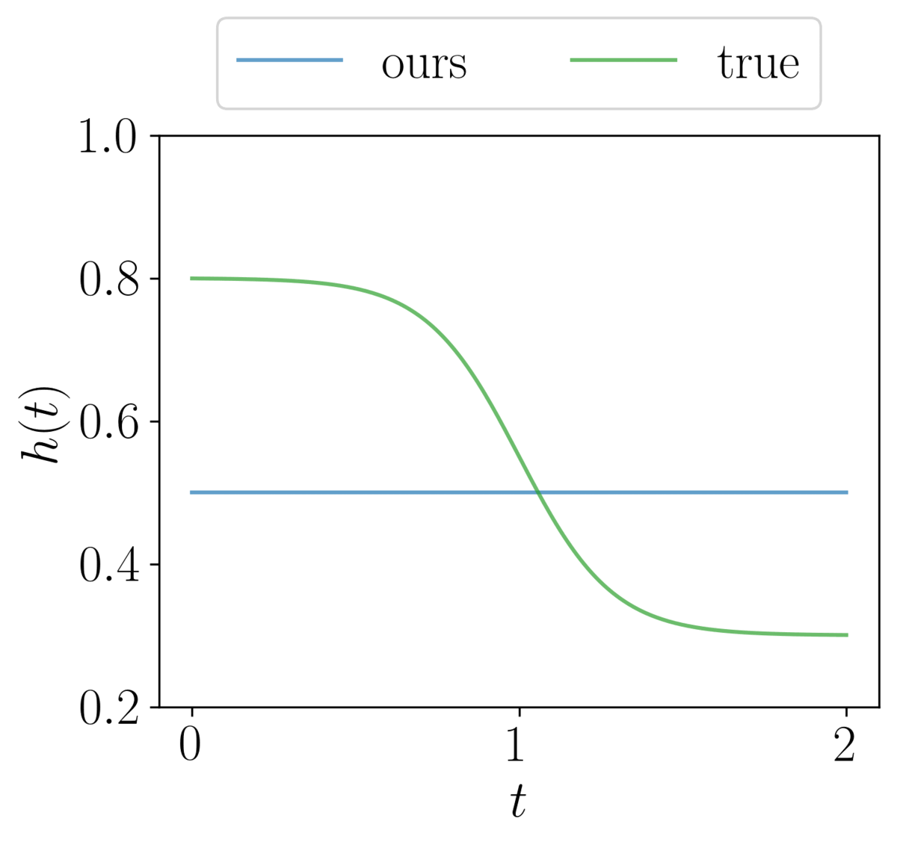

## Learning Fractional Brownian Noises for Neural SDEs
Official source code for the NeurIPS 2022 paper [Learning Fractional White Noises for Neural Stochastic Differential Equations](https://openreview.net/forum?id=lTZBRxm2q5)

### Abstract
Differential equations play important roles in modeling complex physical systems.
Recent advances present interesting research directions by combining differential
equations with neural networks. By including noise, stochastic differential equations (SDEs) allows us to model data with uncertainty and measure imprecision. There are many variants of noises known to exist in many real-world data. For
example, previously white noises are idealized and induced by Brownian motions.
Nevertheless, there is a lack of machine learning models that can handle such noises. In this paper, we introduce a generalized fractional white noise to existing models and propose an efficient approximation of noise sample paths based on
classical integration methods and sparse Gaussian processes. Our experimental
results demonstrate that the proposed model can capture noise characteristics such
as continuity from various time series data, therefore improving model fittings over
existing models. We examine how we can apply our approach to score-based generative models, showing that there exists a case of our generalized noise resulting in a better image generation measure.


---
<p align="center">
  
  
</p>
 
### Examples

See [example.ipynb](https://github.com/anh-tong/fractional_neural_sde/blob/main/fractional_neural_sde/example.ipynb).


### JAX implementation

After the NeurIPS submission, we develop a JAX version based on [diffrax](https://github.com/patrick-kidger/diffrax) library.

See [fractional_neural_sde_jax](https://github.com/anh-tong/fractional_neural_sde/tree/main/fractional_neural_sde_jax) folder.


### Citation
```
@inproceedings{
tong2022learning,
title={Learning Fractional White Noises in Neural Stochastic Differential Equations},
author={Anh Tong and Thanh Nguyen-Tang and Toan Tran and Jaesik Choi},
booktitle={Thirty-Sixth Conference on Neural Information Processing Systems (NeurIPS)},
year={2022},
url={https://openreview.net/forum?id=lTZBRxm2q5}
}
```

### Acknowlegments

The PyTorch implementation is based on [torchsde](https://github.com/google-research/torchsde).

The JAX implementation is based on [diffrax](https://github.com/patrick-kidger/diffrax).